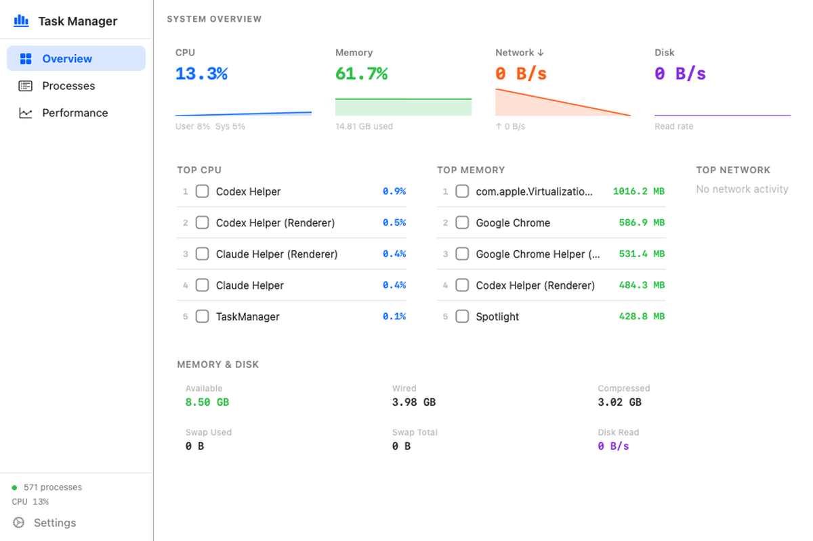

# MacTaskManager

Native macOS task manager built with SwiftUI and AppKit.
It lives in the menu bar, shows live system activity, and opens a full desktop dashboard for process and performance monitoring.



## Overview

MacTaskManager is a lightweight menu-bar utility inspired by Task Manager on Windows, but designed with a clean macOS feel.
It gives you a fast view of CPU, memory, disk, and network usage without opening Activity Monitor, while still letting you drill into processes when needed.

## UI At A Glance

### Menu Bar Experience

- Menu-bar icon for quick access at any time
- Compact popover dashboard with live metrics
- Hotkey support with `Option + Command + M`
- One-click jump from the popover into the full dashboard

### Main Dashboard

- Left navigation rail for `Overview`, `Processes`, and `Performance`
- Overview cards for CPU, Memory, Network, and Disk activity
- Ranked panels for top CPU, memory, and network consumers
- Detailed process table with sorting and search
- Performance charts with rolling history
- Settings panel for appearance preferences

## Features

- Real-time CPU monitoring using native macOS host statistics
- Memory usage breakdown including used, wired, compressed, available, and swap
- System-wide network throughput tracking
- Disk read throughput sampling
- Process inspection with CPU, memory, thread count, and app metadata
- Top-process summaries for quick diagnosis
- Force quit workflow with confirmation and self-protection
- Light, dark, and system appearance modes
- Native SwiftUI and AppKit architecture
- Menu-bar app packaging with `LSUIElement`

## Functionality Breakdown

| Area | What it does |
|---|---|
| Overview | Shows live summary cards and top resource-consuming processes |
| Processes | Lists running processes with CPU, memory, threads, and network usage |
| Performance | Displays rolling charts for system activity over time |
| Settings | Lets the user switch appearance mode |
| Menu Bar | Keeps the app accessible without living in the Dock |

## Under The Hood

| Capability | Implementation |
|---|---|
| CPU monitoring | `host_statistics` / `HOST_CPU_LOAD_INFO` |
| Memory monitoring | `host_statistics64` / `HOST_VM_INFO64` |
| Network monitoring | `getifaddrs` / `if_data` |
| Per-process network | `nettop` subprocess with safe fallback |
| Disk monitoring | `iostat -d` subprocess |
| Process enumeration | `proc_listallpids` + `proc_pidinfo(PROC_PIDTASKINFO)` |
| App metadata | `NSRunningApplication` |
| Hotkey support | Carbon `RegisterEventHotKey` |
| Charts | SwiftUI rendering with rolling history buffers |

## Tech Stack

- Swift 5.9+
- SwiftUI
- AppKit
- Carbon
- Native macOS system APIs

## Project Structure

```text
Sources/MacTaskManager/
  AppDelegate.swift
  ContentView.swift
  MenuBarDashboardView.swift
  MonitorStore.swift
  PerformanceView.swift
  ProcessesView.swift
  SystemSampler.swift
  SupportViews.swift
  Models.swift
  Formatters.swift
scripts/
  package_app.sh
dist/
  MacTaskManager.app
```

## Requirements

- macOS 13 Ventura or later
- Xcode Command Line Tools or full Xcode
- Swift 5.9+

## Run Locally

```bash
swift run
```

The app launches as a menu-bar app.

## Build

```bash
swift build
swift build -c release
```

## Package As A macOS App

```bash
bash scripts/package_app.sh
```

This creates:

```text
dist/MacTaskManager.app
```

## Keyboard Shortcut

| Shortcut | Action |
|---|---|
| `Option + Command + M` | Toggle the menu-bar popover |

## Limitations

- Per-process network parsing depends on `nettop` output format
- Disk write throughput is not separately exposed in the current implementation
- The app is not sandboxed and is not intended for Mac App Store distribution
- Process memory is based on RSS, not total virtual memory
- CPU usage per process can exceed 100% on multi-core systems

## Why This Project

MacTaskManager is a good example of building a polished native macOS utility without web technologies.
It focuses on fast access, real system data, and a compact UI that feels at home on the desktop.
